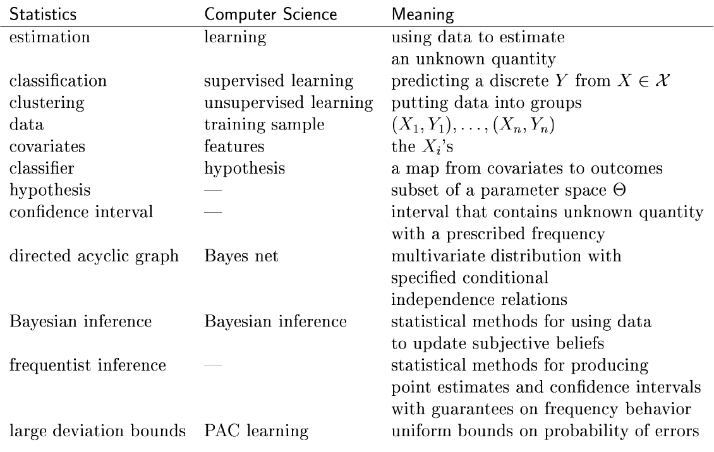

# About
This repository is my record of experimentation of things I mostly read in the book - *All of Statistics: A Concise Course in Statistical Inference by Larry A. Wasserman* and some other statistics and probability related stuff which I find intriguing.

Pic related, got me hooked to the book. There's so much I don't know.

https://www.ic.unicamp.br/~wainer/cursos/1s2013/ml/livro.pdf

*Using fancy tools like neural nets, boosting and support vector machines without understanding basic statistics is like doing brain surgery without knowing how to use a bandaid.* - Larry A. Wasserman

# Status:
Done:
- Gambler's fallacy
- Independent events probability
- Conditional probability
- Law of large numbers
- Correlation
- Covariance
- Quartiles and IQR
- Freedman-Diaconis rule for bin size
- PCA, eigenvectors, eigenvalues
- Central limit theorem
- Normal distribution
- ML for Statisticians

TODO:
- Random variables and distribution
- Z values
